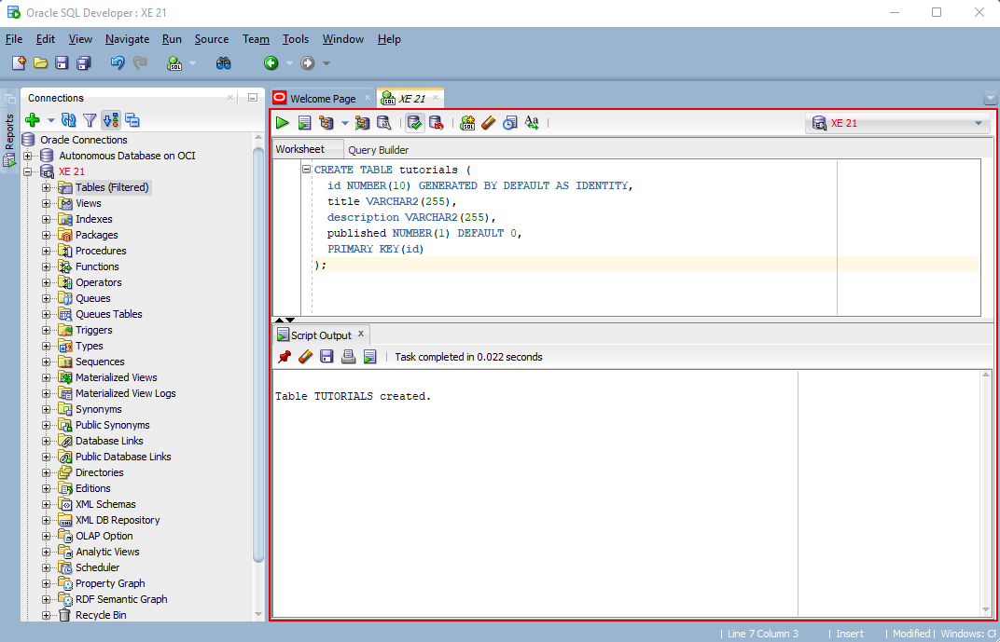
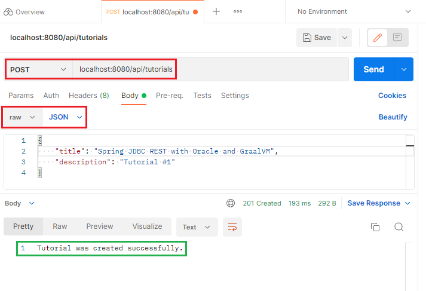
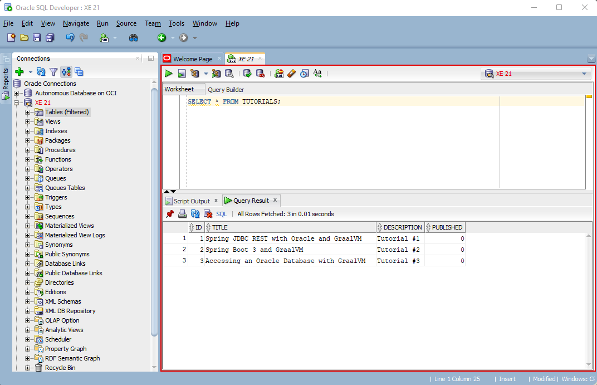
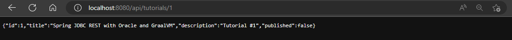
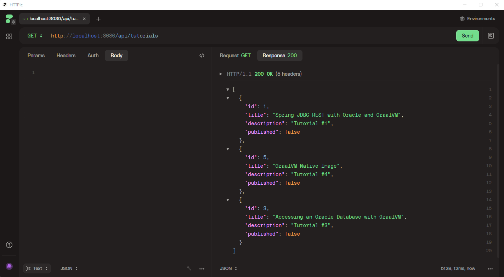

# Oracle JDBC REST Example using Spring Boot 3 and GraalVM

#### Overview

A simple example of accessing a database via a REST API using Spring Boot 3 and GraalVM native image.

#### Credits

This example is based on an article authored by [bezkoder](https://www.bezkoder.com/spring-boot-jdbctemplate-example-oracle/).  Modifications are included to support Spring Boot 3, JDK 17 and GraalVM native image compilation.

#### Prerequisites

We're using Java 17 with GraalVM 22.3.0.

Since we're creating a REST application that accesses a database, we're using the [Oracle Database Express Edition](https://www.oracle.com/database/technologies/appdev/xe.html) (XE 21c).  You can easily deploy a container using the following command:

```
docker run -d -p 1521:1521 -p 5500:5500 -e ORACLE_PASSWORD=password -v oracle-volume:/opt/oracle/oradata gvenzl/oracle-xe
```

Other tools useful for this project include:

* [Oracle Instant Client/SQLPlus](https://www.oracle.com/database/technologies/instant-client.html)
* [HTTPie](https://httpie.io/), [Postman](https://www.postman.com/downloads/) (or another API testing tool) 
* [Oracle SQL Developer](https://www.oracle.com/database/sqldeveloper/)

#### Configure the Database

Create the following `tutorials` table in the database using Oracle SQL Developer (or your tool of choice):

```
CREATE TABLE tutorials (
  id NUMBER(10) GENERATED BY DEFAULT AS IDENTITY,
  title VARCHAR2(255),
  description VARCHAR2(255),
  published NUMBER(1) DEFAULT 0,
  PRIMARY KEY(id)
);
```




#### Building the Project

Clone the project:

```
git clone https://github.com/swseighman/Spring-JDBC-REST-GraalVM.git
```

Build the project:

```
cd Spring-JDBC-REST-GraalVM
mvn clean package
```

Start the application:

```
java -jar target/spring-boot-jdbctemplate-oracle-0.0.1-SNAPSHOT.jar
```
Note the startup time (**1.9 seconds**):

```
2023-01-27T11:07:11.978-05:00  INFO 3151 --- [           main] .SpringBootJdbctemplateOracleApplication : Started SpringBootJdbctemplateOracleApplication in 1.927 seconds (process running for 2.255)
```
<br/>
Add some data to the `tutorials` table using HTTPie, Postman or your favorite API tool.

* Choose `POST`
* Use the URL `http://localhost:8080/api/tutorials` 
* Choose `raw` and `JSON` as the type
* Add the tutorial content
* Click the `Send` button



Add a few more entries in the table.

Using SQL Developer, check the contents of the `tutorial` table:




Access the REST endpoint to display the contents of a `tutorial`.

Browse to:  `http://http://localhost:8080/api/tutorials/1`



There are additional APIs provided, feel free to test another endpoint:
```
Methods	Urls	                        Actions
POST    /api/tutorials	                create new Tutorial
GET     /api/tutorials	                retrieve all Tutorials
GET     /api/tutorials/:id              retrieve a Tutorial by :id
PUT     /api/tutorials/:id              update a Tutorial by :id
DELETE	/api/tutorials/:id              delete a Tutorial by :id
DELETE	/api/tutorials                  delete all Tutorials
GET     /api/tutorials/published        find all published Tutorials
GET     /api/tutorials?title=[keyword]	find all Tutorials which title contains keyword
```

For example, you can GET all of the tutorials in the table:

Perform a GET: `http://localhost:8080/api/tutorials`




#### Create a Native Image Executable


Run the tracing agent to create configuration files:

```
mvn -PnativeTest -DskipNativeTests=true -DskipNativeBuild=true -Dagent=true test
```

Create the native image executable using the configuration files:

```
mvn -Pnative native:compile -Dagent=true -DskipTests package
```

Start the native image executable:

```
target/
```

Notice the startup time (**107 ms**): 

```
2023-01-27T11:05:09.123-05:00  INFO 2920 --- [           main] .SpringBootJdbctemplateOracleApplication : Started SpringBootJdbctemplateOracleApplication in 0.107 seconds (process running for 0.109)
```
<br/>
Repeat the same tests used for the `jar` version of the application (above).

Access the REST endpoint to display the contents of a `tutorial`.

Browse to:  `http://http://localhost:8080/api/tutorials/1`
 
#### Summary

In this example we created a project that accesses and Oracle Database via REST APIs using the JDBC driver and Spring Boot 3.  In addition, we created a native image executable of the same application that starts up lightning fast (107 ms).<br/><br/>

